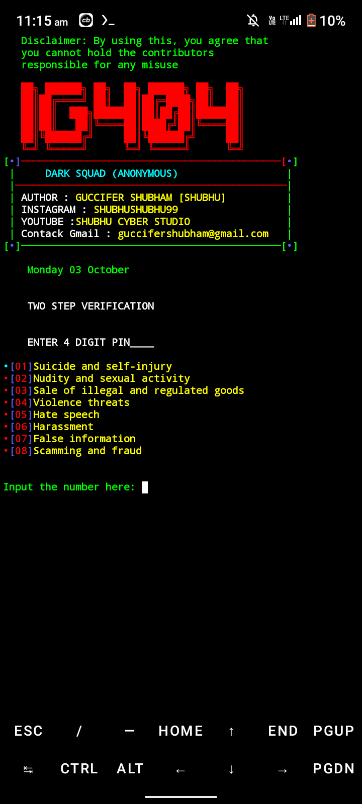
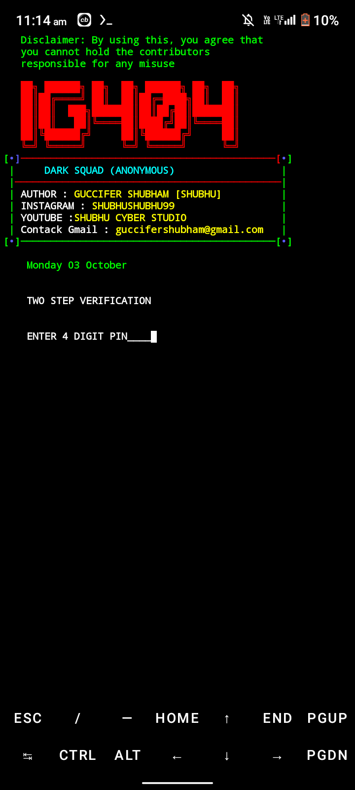
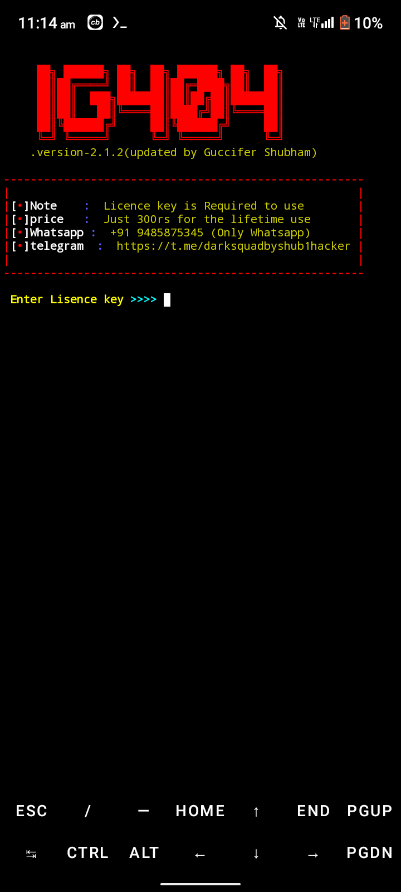

# IG404
Instagram auto reporting tool 100% working with latest techniques 

## Description

this tool is made by Guccifer Shubham (shubhushubhu99) and by using this tool you can reports a targeted instagram account. It uses multi threading, therefore it reports very fast. 
This tool is strongly recommended for educational purpose but before using this this I'll tell you this tool isn't made for illegal purpose and if you're performing any illegal activities then we're not responsible for any kind of damage 

## Getting Started

### Dependencies

* to run this program make sure you've successfully installed termux on your android..


### Executing program

* update and upgrade your termux if you get any problem while excuting this program
```
pkg install git
```
```
git clone https://github.com/shubhushubhu99/IG404.git
```
```
ls 
```
```
cd IG404
```
```
bash setup.sh
```
```
NOTE: before entering the lisence code don't forget to run tor via type tor in 2nd or another session
```
## Help

if pkg update command will not work then first upgrade your termux and type y alltimes whenever asked..
```
pkg upgrade
pkg upgrade
```
## Screenshots:

#### Main View:





## This repository is open source to help others. So if you wish to copy, consider giving credit!
 
## Authors

DARK SQUAD (ANONYMOUS)

* AUTHER: GUCCIFER SHUBHAM
* WHATSAPP: +91 9485875345
* FACEBOOK: https://www.facebook.com/shubhushubhu99
* INSTAGRAM: https://www.instagram.com/shubhushubhu99
* TWITER: https://twitter.com/shubhushubhu99
* YOUTUBE: https://www.youtube.com/channel/UCAopWtmrflBhznkOxHhSdIg

